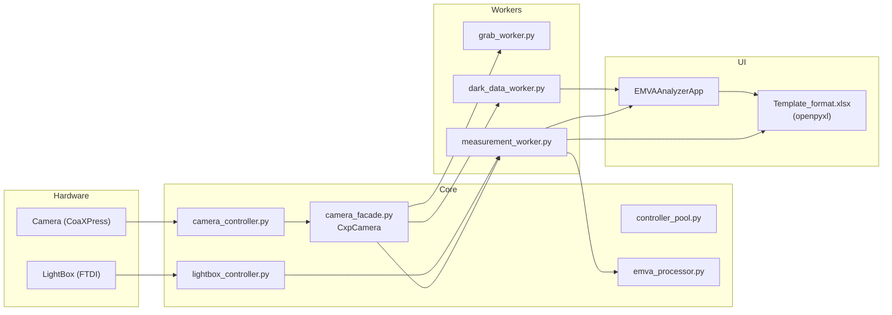

# EMVA 1288 Analyzer

A PyQt5-based GUI application for characterizing cameras according to the **EMVA 1288 standard** while controlling both the camera and a lightbox.

- Camera control via Coaxlink + Euresys eGrabber
- Lightbox (FTDI-based) brightness control
- Automatic measurement sequences for Dark / Light / Saturation, etc.
- Automatic export of measurement results into the **Template_format.xlsx** workbook

---

## Main Features

### 1. Camera Control (CoaXPress / eGrabber)

Handled by `core/camera_controller.py`, `core/camera_facade.py`, and `core/controller_pool.py`.

- Uses the Euresys **eGrabber** SDK to discover, connect, disconnect, and grab frames from cameras
- Supports both single and multi-camera setups through a controller-pool design
- Delivers frames to the upper layers as `numpy.ndarray` (2D/3D)
- Provides a `CxpCamera(QObject)` wrapper to integrate with PyQt5 signals/slots

### 2. Lightbox Control

Implemented in `core/lightbox_controller.py` using `ctypes` to call into the FTDI DLL directly.

- Wraps low-level functions such as `FT_ListDevices`, `FT_OpenEx`, etc.
- Supports setting brightness levels, turning the lightbox on/off, and monitoring communication status
- Coordinates with camera exposure/gain to reproduce the illumination levels required by EMVA measurements

### 3. EMVA 1288 Data Processing

`core/emva_processor.py` provides the basic calculations required by the EMVA standard.

- For Bayer RAW images:
  - Separates Gr, R, Gb, and B channels (`separate_bayer_channels`)
- For RGB images:
  - Separates R, G, and B channels
- For two images captured under the same condition (e.g., A/B frames):
  - Computes per-channel mean signal
  - Temporal noise
  - Total noise

The `MeasurementWorker` calls these functions to convert captured frame pairs into EMVA-compliant numeric results.

### 4. Measurement Workers

`workers/measurement_worker.py`, `workers/dark_data_worker.py`, and `workers/grab_worker.py` share the workload:

- **GrabWorker**
  - Runs as a background `QThread` and continuously drains the camera’s frame queue
  - Optionally uses `cv2.resize` to downscale frames for display
- **MeasurementWorker**
  - Controls both the camera and the lightbox
  - Captures multiple frames for each exposure/illumination step
  - Computes EMVA metrics and forwards results to the UI and Excel
- **DarkDataWorker**
  - Dedicated worker for collecting stable dark (shutter-closed) statistics (mean/noise)

---

## Project Structure

```text
EMVA_1288_Analyzer/
├─ main.py                      # Main GUI and application entry point
├─ Template_format.xlsx         # Excel template for EMVA 1288 results
├─ vieworks.ico                 # Windows icon
├─ core/
│  ├─ camera_controller.py      # eGrabber-based camera control
│  ├─ camera_exceptions.py      # Camera-related exception definitions
│  ├─ camera_facade.py          # Qt-friendly CxpCamera wrapper
│  ├─ controller_pool.py        # CameraController pool management
│  ├─ emva_processor.py         # EMVA computation logic
│  └─ lightbox_controller.py    # FTDI-based lightbox control
└─ workers/
   ├─ dark_data_worker.py       # Dark-frame collection worker
   ├─ grab_worker.py            # Background frame-draining worker
   └─ measurement_worker.py     # EMVA measurement sequence worker
```

---

## Architecture Diagram



---

## Main UI (main.py)

`EMVAAnalyzerApp(QMainWindow)` composes the main user interface.

- **Connection Panel**
  - Shows camera connection status (Disconnected / Connected)
  - Button to reconnect the camera

- **Lightbox Control Panel**
  - Sets brightness units (0 ~ `DEFAULT_LB_MAX_UNITS`)
  - On/off control and communication status display

- **Measurement Panel**
  - Selects Bayer pattern (e.g., RGGB, GRBG, etc.)
  - Configures exposure time, number of frames, number of repeats, and so on
  - Buttons to start/stop measurements
  - Shows progress bar and status messages for the current step

- **Results Area**
  - Displays per-step mean/noise values in tables
  - Exports the results to `Template_format.xlsx` when requested

### Excel Export Flow

1. `_template_candidates()` locates possible paths to the Excel template  
2. A copy of `Template_format.xlsx` is created  
3. The copy is opened with `openpyxl`, and the measurement results are written into it

---

## Dependencies

External libraries used directly in the code:

- `PyQt5`  – GUI (Qt Widgets, Core, Gui)
- `numpy`  – numeric computation and frame data handling
- `opencv-python` (`cv2`) – display-time resizing in `GrabWorker`
- `openpyxl` – reading/writing the `Template_format.xlsx` Excel workbook
- `egrabber` – Euresys Coaxlink / eGrabber camera SDK (Python bindings)

---

## Example requirements.txt

```text
PyQt5==5.15.11
numpy==1.24.4
opencv-python==4.11.0.86
openpyxl==3.1.5
egrabber==25.3.2.80
```

---

## Installation & Usage

```bash
pip install -r requirements.txt
```

### Run

```bash
python main.py --theme auto
```

Examples of options:

- `--theme auto|light|dark` – selects the UI theme
- `--icon path/to/icon.ico` – overrides the window/taskbar icon

The path resolution logic for the template and icon is designed to work both in a normal Python environment and in a PyInstaller-packaged executable by checking the PyInstaller runtime folder (`sys._MEIPASS`).

---

## Notes

- To use real hardware:
  - Install an Euresys Coaxlink frame grabber and the eGrabber SDK
  - Install FTDI drivers for the lightbox
- Without the hardware:
  - Some parts of the code may run in a dummy mode
  - However, meaningful EMVA results require a real camera and lightbox setup
